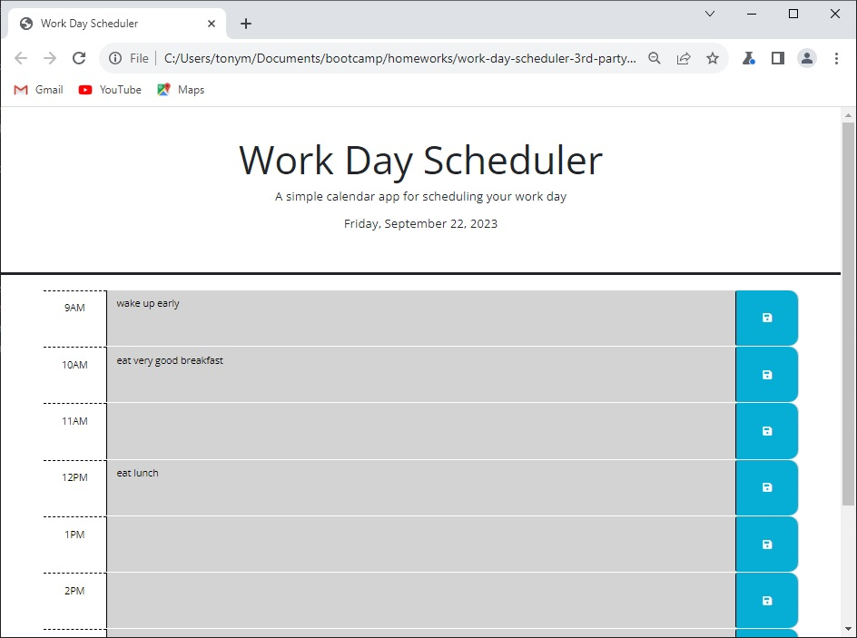

# Work Day Scheduler - Tony Magrady

## README Author
Tony Magrady - Berkeley Full-Stack Web Development Bootcamp student  
-- September 22, 2023

## Description
Daily planner calendar webpage (for current day) that allows a user to save events for each hour of a typical working day (9am–5pm). It has color-coded hour intervals to highlight current time of day, before, and after. 
The time slots are text fields for the activities of the day, which can be saved to local storage via save button and retrieved upon page load or refresh:  https://tonymagr.github.io/work-day-scheduler-3rd-party-apis/

Module 5 skills and tools that I used in webpage deployment were:
- HTML Access to CSS frameworks, jQuery library, and Day.js library
- Day.js formatting
- Dynamic styling updates with jQuery
- jQuery event listeners
- Use of JavaScript forEach method on all target DOM elements that are selected-All
  - Amninder Singh, classmate of Aug-23 FS Bootcamp, assisted me here

## Website Image

## Challenges
I attempted to listen for click events of the Save buttons of all time slots through event delegation on the work-schedule container div and use of event.target, but I was not able to access the element text. I received assistance from a classmate (in Credits below) and changed technique to JavaScript forEach method to loop through selected elements from querySelectorAll. This worked.

## Installation
N/A

## Usage
Employees, managers, non-for-profit team members, and volunteers can use this Work Day Planner to save notable events by time and retrieve them later. It is good for class exercise, but a real-world improvement would be to expand this calendar to future and past days to maximize the use of the stored calendar information.

## Credits
Amninder Singh, classmate of Aug-23 FS Bootcamp, assisted me on the use of JavaScript forEach method on all target DOM elements that are selected-All. (In this case to detect a click event on any save button in the hourly calendar.)

## License
MIT License

Copyright (c) 2023 Tony Magrady

Permission is hereby granted, free of charge, to any person obtaining a copy
of this software and associated documentation files (the "Software"), to deal
in the Software without restriction, including without limitation the rights
to use, copy, modify, merge, publish, distribute, sublicense, and/or sell
copies of the Software, and to permit persons to whom the Software is
furnished to do so, subject to the following conditions:

The above copyright notice and this permission notice shall be included in all
copies or substantial portions of the Software.

THE SOFTWARE IS PROVIDED "AS IS", WITHOUT WARRANTY OF ANY KIND, EXPRESS OR
IMPLIED, INCLUDING BUT NOT LIMITED TO THE WARRANTIES OF MERCHANTABILITY,
FITNESS FOR A PARTICULAR PURPOSE AND NONINFRINGEMENT. IN NO EVENT SHALL THE
AUTHORS OR COPYRIGHT HOLDERS BE LIABLE FOR ANY CLAIM, DAMAGES OR OTHER
LIABILITY, WHETHER IN AN ACTION OF CONTRACT, TORT OR OTHERWISE, ARISING FROM,
OUT OF OR IN CONNECTION WITH THE SOFTWARE OR THE USE OR OTHER DEALINGS IN THE
SOFTWARE.

---